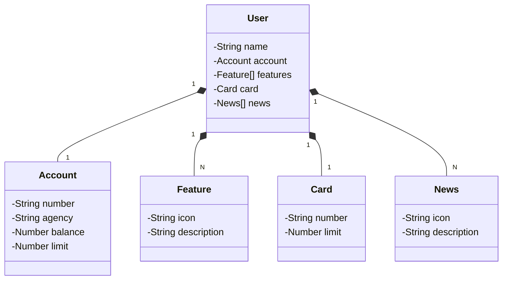

# Java-santander-dev-week-2023
- Java RESTFul API criada para Santander dev week 2023


| Estudos    | Java                                                |
|------------|-----------------------------------------------------|
| Módulo     | Explorando Padrões de Projetos na Prática com Java  |
| Bootcamp   | Santander Bootcamp 2023 - Fullstack Java+Angular    |
| Com        | Venilton FalvoJr - @falvojr                         |
| Plataforma | DIO                                                 |

## Diagrama de classes



##
Acessar o banco de dados:
```
http://localhost:8080/h2-console/
```

OpenAPI definition:
```
http://localhost:8080/swagger-ui/index.html
```
##

**Publicação da API pelo Railway:**

https://sant-dev-week-2023-prod.up.railway.app/swagger-ui/index.html#/

##


### Tecnologias utilizadas:

<div>
  
  
</div>


